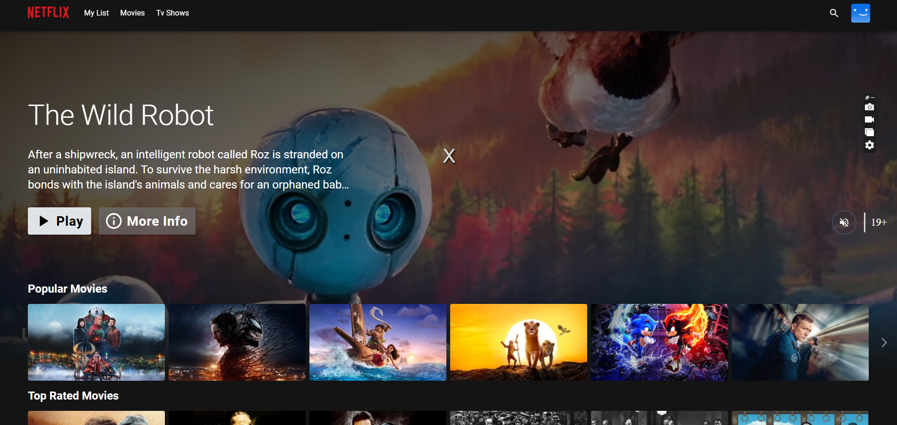

<div align="center">
  

  <br>
  <a href="https://netflix-clone-with-tmdb-using-react-mui.vercel.proneersolve.com/">
    
  </a>
</div>

<br />

<div align="center">
  
  <p align="center">Home Page</p>
</div>

# Step-by-Step Video Tutorial

Watch the detailed setup and deployment tutorial on YouTube:
[](https://www.youtube.com/watch?v=zZqUOtcZOeI)

## Subscribe for More Tutorials
[Subscribe to CloudCatalyst5050 on YouTube](https://www.youtube.com/@CloudCatalyst5050)

---

# Deploying Netflix Clone on AWS Cloud Using Jenkins

This project demonstrates how to deploy a Netflix Clone on the aws cloud using DevSecOps practices. Below is a detailed guide divided into multiple phases.

## **Phase 1: Initial Setup and Deployment**

### **1. Launch EC2 Instance**
- Provision an AWS EC2 instance with Ubuntu 22.04.
- Connect to the instance using SSH.

### **2. Clone the Code**
Update all packages and clone the application repository:

```bash
git clone https://github.com/bilalkmk/Deploying-Netflix-Clone-on-AWS-Cloud-Using-Jenkins.git
```

### **3. Install Docker and Run the App**

Set up Docker on the EC2 instance:

```bash
sudo apt-get update
sudo apt-get install docker.io -y
sudo usermod -aG docker $USER  # Replace $USER with your username
newgrp docker
sudo chmod 777 /var/run/docker.sock
```

Build and run the application using Docker:

```bash
docker build -t netflix .
docker run -d --name netflix -p 8081:80 netflix:latest
```

### **4. Obtain TMDB API Key**

1. Visit the [TMDB website](https://www.themoviedb.org/) and log in or create an account.
2. Navigate to "Settings" > "API" and generate a new API key.
3. Rebuild the Docker image using your API key:

```bash
docker build --build-arg TMDB_V3_API_KEY=<your-api-key> -t netflix .
```

---

## **Phase 2: Security**

### **1. Install SonarQube and Trivy**

#### **Install SonarQube**

```bash
docker run -d --name sonar -p 9000:9000 sonarqube:lts-community
```
Access SonarQube at `http://<your-ec2-ip>:9000` (default credentials: `admin`/`admin`).

#### **Install Trivy**

```bash
sudo apt-get install wget apt-transport-https gnupg lsb-release
wget -qO - https://aquasecurity.github.io/trivy-repo/deb/public.key | sudo apt-key add -
echo deb https://aquasecurity.github.io/trivy-repo/deb $(lsb_release -sc) main | sudo tee -a /etc/apt/sources.list.d/trivy.list
sudo apt-get update
sudo apt-get install trivy
```
Scan your Docker images using Trivy:

```bash
trivy image <image-id>
```

---

## **Phase 3: CI/CD Setup**

### **1. Install Jenkins**

Install Jenkins on the EC2 instance:

```bash
sudo apt update
sudo apt install fontconfig openjdk-17-jre
java -version
sudo wget -O /usr/share/keyrings/jenkins-keyring.asc \
  https://pkg.jenkins.io/debian-stable/jenkins.io-2023.key
echo deb [signed-by=/usr/share/keyrings/jenkins-keyring.asc] \
  https://pkg.jenkins.io/debian-stable binary/ | sudo tee \
  /etc/apt/sources.list.d/jenkins.list > /dev/null
sudo apt-get update
sudo apt-get install jenkins
sudo systemctl start jenkins
sudo systemctl enable jenkins
```
Access Jenkins at `http://<your-ec2-ip>:8080`.

### **2. Install Necessary Plugins**

- Go to `Manage Jenkins` > `Plugins` > `Available Plugins` and install:
  1. Eclipse Temurin Installer
  2. SonarQube Scanner
  3. NodeJs Plugin
  4. Email Extension Plugin

### **3. Configure Jenkins Pipeline**

Define the pipeline with tools like SonarQube, Trivy, and Docker integration:

```groovy
pipeline {
  agent any
  tools {
    jdk 'jdk17'
    nodejs 'node16'
  }
  environment {
    SCANNER_HOME = tool 'sonar-scanner'
  }
  stages {
    stage('Clean Workspace') {
      steps {
        cleanWs()
      }
    }
    stage('Checkout from Git') {
      steps {
        git branch: 'main', url: 'https://github.com/bilalkmk/Deploying-Netflix-Clone-on-AWS-Cloud-Using-Jenkins.git'
      }
    }
    stage('SonarQube Analysis') {
      steps {
        withSonarQubeEnv('sonar-server') {
          sh '''$SCANNER_HOME/bin/sonar-scanner -Dsonar.projectName=Netflix \
            -Dsonar.projectKey=Netflix'''
        }
      }
    }
    stage('Quality Gate') {
      steps {
        script {
          waitForQualityGate abortPipeline: false, credentialsId: 'Sonar-token'
        }
      }
    }
    stage('Install Dependencies') {
      steps {
        sh "npm install"
      }
    }
    stage('Build & Push Docker Image') {
      steps {
        script {
          withDockerRegistry(credentialsId: 'docker', toolName: 'docker') {
            sh "docker build --build-arg TMDB_V3_API_KEY=<your-api-key> -t netflix ."
            sh "docker tag netflix user/netflix:latest"
            sh "docker push user/netflix:latest"
          }
        }
      }
    }
  }
}
```

---

## **Phase 4: Monitoring**

### **1. Install Prometheus and Grafana**

#### **Prometheus Setup**

Download and configure Prometheus to collect metrics:

```bash
wget https://github.com/prometheus/prometheus/releases/download/v2.47.1/prometheus-2.47.1.linux-amd64.tar.gz
tar -xvf prometheus-2.47.1.linux-amd64.tar.gz
sudo mv prometheus /usr/local/bin/
```

#### **Grafana Setup**

Add the Grafana repository and install:

```bash
sudo apt-get install -y apt-transport-https software-properties-common
wget -q -O - https://packages.grafana.com/gpg.key | sudo apt-key add -
echo "deb https://packages.grafana.com/oss/deb stable main" | sudo tee -a /etc/apt/sources.list.d/grafana.list
sudo apt-get update
sudo apt-get install grafana
sudo systemctl start grafana-server
```
Access Grafana at `http://<your-server-ip>:3000`.

---

## **Phase 5: Cleanup**

### **Terminate Resources**
- Ensure to terminate unused EC2 instances and resources to prevent incurring costs.

